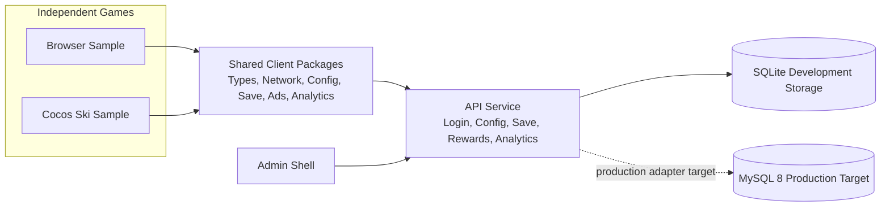

# mini-game-workflow

English | [中文](README.md)


A reusable TypeScript monorepo for multiple mini games. It provides shared game contracts and client capabilities, a replaceable API service, an admin shell, and a Cocos Creator ski-game sample.

> This is an early runnable `0.1.0` release. It is suitable for learning, extension, and validating architectural boundaries. Before a production release, complete your own security review, data backup, compliance work, and platform review.

## What Is Included

- `packages/`: shared types plus configuration, save, network, advertising, and analytics capabilities. They do not contain game-specific rules.
- `services/api-server`: a local SQLite development service with configuration, save, reward, admin authentication, and audit models.
- `services/admin-web`: an admin shell intended for a solo developer.
- `apps/game-sample`: a browser client for exercising shared capabilities end to end.
- `apps/ski-endless/client`: a Cocos Creator 3.8.8 ski-game sample with a WeChat Mini Game integration entry point.
- `docs/` and `sql/`: architecture constraints, contracts, and the target MySQL 8 production data model.

## Architecture



Gameplay, art, and screens stay in `apps/<game>/`. A capability moves into `packages/` only after it has been validated by more than one game. `gameKey` isolates configuration, saves, identity, and live-operations data.

## Quick Start

Prerequisites: Node.js 22, npm, and Cocos Creator 3.8.8 for the Cocos sample.

```bash
npm install
npm run setup:ski-local-config
npm run build
npm run dev:stack
```

Local endpoints:

- Portal: `http://127.0.0.1:3100`
- Admin: `http://127.0.0.1:3100/admin.html`
- Browser sample: `http://127.0.0.1:3100/game-sample.html`
- API health check: `http://127.0.0.1:3000/health`

The local development-only administrator account is `admin / dev-admin-password`.

## Cocos Sample

`apps/ski-endless/client` is an independent Cocos project. Cocos Creator generates local `temp/` and `library/` directories; they are neither committed nor part of the reproducible Node.js build.

1. Open `apps/ski-endless/client` in Cocos Creator 3.8.8.
2. Preview or build the mini game from the editor.
3. For an additional command-line check, wait for the editor to finish importing and run:

```bash
npm run build:with-cocos
```

`npm run setup:ski-local-config` creates a local configuration file from the public example when it is missing. Set your API endpoint and ad units in `SkiEndlessPlatformConfig.local.ts`. The file is Git-ignored: never commit real AppIDs, domains, ad-unit IDs, passwords, or tokens.

Without a configured ad unit, the WeChat runtime rejects rewards by default. Setting `allowMockRewardedVideoOnInvalidAdUnitId` to `true` explicitly enables a local integration mock; never release a production build with that setting enabled.

## Verification

```bash
npm run build
npm run verify:minimal
npm run verify:dev-stack
npm run verify:persistence
npm run verify:ci
```

Public CI runs the reproducible checks above. Cocos validation is performed locally after Cocos Creator has generated its engine declarations, which do not belong in this repository.

## FAQ

### Why does the root build not check Cocos scripts?

Cocos Creator generates engine declarations and the `temp/` directory locally. The root `npm run build` checks only workspaces that can be reproduced from a clean clone. After importing the Cocos project, use `npm run build:with-cocos` to check the ski sample.

### What is the relationship between SQLite and MySQL?

SQLite is the local development and integration persistence layer, allowing a one-command startup. `sql/` and `docs/05-data/` define MySQL 8 as the production target. The production database adapter and migration workflow are roadmap work; do not treat the development SQLite file as a production database.

### Should configuration files, AppIDs, and ad-unit IDs be committed?

No. `SkiEndlessPlatformConfig.local.ts`, `.env`, and Cocos local files are ignored. Commit only `*.example.*` templates. Keep real API endpoints, AppIDs, ad-unit IDs, passwords, and tokens in local files or deployment-platform Variables and Secrets.

### Can WeChat login be used for a production release now?

No. The current API handling of `code` is for local and automated integration only. Production WeChat login must exchange the short-lived `wx.login()` code for a stable openid on the server with an AppSecret. That identity resolver is a release prerequisite. Never put the AppSecret in the Cocos client or this repository.

### Why is the deployment workflow skipped?

Public CI is separate from private deployment. Forks and public clones without every deployment Variable safely skip deployment; this does not affect `Validate` or the reproducible checks.

### How can I contribute or report a problem?

Read [CONTRIBUTING.md](CONTRIBUTING.md) before submitting changes. A feature request must state whether it belongs to the shared layer or one game. Report security issues privately according to [SECURITY.md](SECURITY.md).

## Deployment

The API service supports Docker deployment. Keep production configuration only in the deployment environment or GitHub Actions Variables and Secrets, never in the repository. See:

- [Dockerfile](Dockerfile)
- [Environment example](.env.production.example)
- [Deployment workflow](.github/workflows/deploy-api-server.yml)

The deployment workflow runs only after the required repository Variables have been configured. Forks and public clones without them do not fail public validation.

## Versioning and Roadmap

- Version compatibility and release rules: [Versioning policy](docs/07-dev-process/03-VERSIONING_AND_RELEASE_POLICY.md)
- Public next-stage goals: [ROADMAP.md](ROADMAP.md)
- Deployment, backup, restore, and incident boundaries: [Operations runbook](docs/08-operations/00-OPERATIONS_RUNBOOK.md)

## Contribution and Security

- Contribution workflow: [CONTRIBUTING.md](CONTRIBUTING.md)
- Security reports: [SECURITY.md](SECURITY.md). Do not disclose vulnerabilities or secrets publicly.
- Community behavior: [CODE_OF_CONDUCT.md](CODE_OF_CONDUCT.md)
- Change history: [CHANGELOG.md](CHANGELOG.md)

## License

This project is licensed under the [Apache License 2.0](LICENSE).
