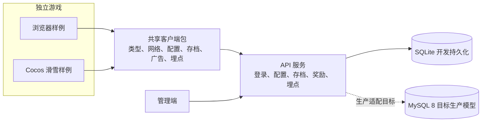

# mini-game-workflow

[English](README.en.md) | 中文


一个面向多款小游戏复用的 TypeScript monorepo：共享游戏协议与客户端能力、可替换的 API 服务、管理端壳，以及基于 Cocos Creator 的滑雪样例游戏。

> 当前为 `0.1.0` 早期可运行版本。它适合学习、二次开发和验证架构边界；生产发布前仍应完成自己的安全、数据备份、合规与平台审核。

## 包含什么

- `packages/`：不包含具体玩法的共享类型、配置、存档、网络与奖励能力。
- `services/api-server`：本地 SQLite 开发服务，包含配置、存档、奖励、管理端鉴权与审计模型。
- `services/admin-web`：单人开发者可用的管理端壳。
- `apps/game-sample`：浏览器样例客户端，用于联调共享能力。
- `apps/ski-endless/client`：Cocos Creator 3.8.8 滑雪样例，包含微信小游戏平台适配入口。
- `docs/`、`sql/`：架构约束、协议和面向 MySQL 8 的目标生产数据模型。

## 架构



游戏玩法、美术和页面留在 `apps/<game>/`；只有经过多个游戏验证的能力才进入 `packages/`。`gameKey` 用于配置、存档、身份和运营数据隔离。

## 快速开始

前置条件：Node.js 22、npm，以及 Cocos 样例开发所需的 Cocos Creator 3.8.8。

```bash
npm install
npm run setup:ski-local-config
npm run build
npm run dev:stack
```

本地入口：

- 门户：`http://127.0.0.1:3100`
- 管理端：`http://127.0.0.1:3100/admin.html`
- 浏览器样例：`http://127.0.0.1:3100/game-sample.html`
- API 健康检查：`http://127.0.0.1:3000/health`

本地开发管理员账号仅用于开发环境：`admin / dev-admin-password`。

## Cocos 样例

`apps/ski-endless/client` 是独立的 Cocos 项目，Cocos Creator 会生成 `temp/`、`library/` 等本机文件；这些文件不会提交，也不属于可复现的 Node.js 构建。

1. 用 Cocos Creator 3.8.8 打开 `apps/ski-endless/client`。
2. 在编辑器中预览或构建小游戏。
3. 需要命令行额外校验时，先让编辑器完成导入，再执行：

```bash
npm run build:with-cocos
```

`npm run setup:ski-local-config` 会在缺失时从公开示例生成本机配置文件。请在生成的 `SkiEndlessPlatformConfig.local.ts` 中填写自己的 API 地址和广告位；它已被 Git 忽略，不能提交真实 AppID、域名或广告位 ID。未配置广告位时，微信运行时默认拒绝发放奖励；只有明确将 `allowMockRewardedVideoOnInvalidAdUnitId` 设为 `true` 才会启用本机联调用的模拟广告，绝不能随正式包发布。

## 验证

```bash
npm run build
npm run verify:minimal
npm run verify:dev-stack
npm run verify:persistence
npm run verify:ci
```

公开 CI 会执行上述可复现验证。Cocos 校验由本地 Cocos Creator 环境完成，因为其生成的引擎声明不应进入仓库。

## 常见问题

### 为什么根构建不校验 Cocos 脚本？

Cocos Creator 会在本机生成引擎类型声明和 `temp/` 目录，它们不应提交。根 `npm run build` 只校验干净克隆可复现的 Node.js 工作区；打开 Cocos Creator 导入项目后，使用 `npm run build:with-cocos` 校验滑雪项目。

### SQLite 和 MySQL 的关系是什么？

当前 SQLite 是本地开发和联调持久化层，便于一键启动。`sql/` 与 `docs/05-data/` 仍以 MySQL 8 为生产目标；生产数据库适配与迁移是公开路线图中的后续工作，不能把开发 SQLite 文件直接当作生产方案。

### 配置文件、AppID 和广告位应该提交吗？

不应该。`SkiEndlessPlatformConfig.local.ts`、`.env` 和 Cocos 本机文件都被忽略。只提交 `*.example.*` 模板，真实 API 地址、AppID、广告位、密码和令牌必须留在本机或部署平台的 Variables / Secrets 中。

### 微信登录现在可以直接用于正式发布吗？

不可以。当前 API 的 `code` 身份处理只用于本地和自动化联调；正式微信登录必须在服务端用 AppSecret 将 `wx.login()` 的短期 code 换成稳定 openid。该身份解析器是路线图中的发布前置条件，不能把 AppSecret 放入 Cocos 客户端或 Git 仓库。

### 为什么部署工作流显示为跳过？

公开 CI 与私有部署分开。未配置所有部署 Variables 的 fork 或开源克隆会安全跳过部署；这不影响 `Validate` 对构建和核心链路的验证。

### 如何提出问题或参与开发？

提交前先阅读 [CONTRIBUTING.md](CONTRIBUTING.md)。功能请求必须说明它属于共享层还是单个游戏；安全问题必须按 [SECURITY.md](SECURITY.md) 私密报告。

## 部署

API 服务支持 Docker 部署。生产配置应只保存在部署环境或 GitHub Actions 的 Variables / Secrets 中，不能提交到仓库。参考：

- [Dockerfile](Dockerfile)
- [环境变量示例](.env.production.example)
- [部署工作流](.github/workflows/deploy-api-server.yml)

部署工作流只会在所需的仓库 Variables 都配置后执行；未配置的 fork 或公开克隆不会因此导致验证失败。

## 版本与路线图

- 版本兼容性与发布规则见 [版本策略](docs/07-dev-process/03-VERSIONING_AND_RELEASE_POLICY.md)。
- 下一阶段的公开目标见 [ROADMAP.md](ROADMAP.md)。
- 部署、备份、恢复与故障处理边界见 [运行手册](docs/08-operations/00-OPERATIONS_RUNBOOK.md)。

## 参与和安全

- 贡献方式见 [CONTRIBUTING.md](CONTRIBUTING.md)。
- 安全问题见 [SECURITY.md](SECURITY.md)，请勿公开泄露漏洞或密钥。
- 社区行为规范见 [CODE_OF_CONDUCT.md](CODE_OF_CONDUCT.md)。
- 变更记录见 [CHANGELOG.md](CHANGELOG.md)。

## License

本项目采用 [Apache License 2.0](LICENSE)。
